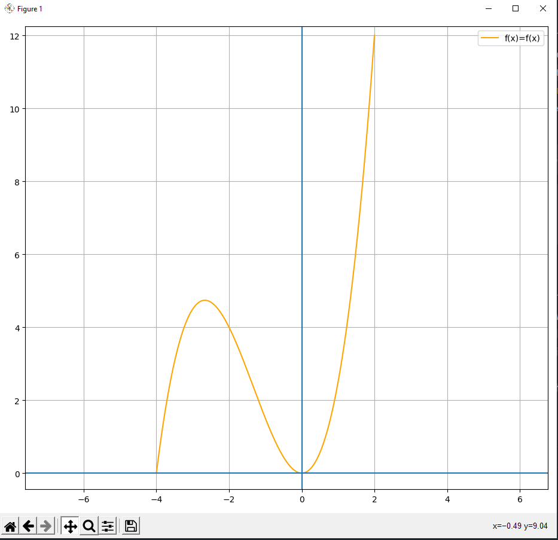

# **A simple interactive interpreter written in python**

## Installation

To run the program, simply clone the repository (or download the source code) and run main.py with Python 3.9+. <br>
You will need [numpy](https://pypi.org/project/numpy/) v1.22.1+ and [matplotlib](https://pypi.org/project/matplotlib/)
v3.5.1+ for plotting purposes. <br>
When running main.py, you can specify the following arguments:

| Argument              | Function                                                                                 | Default  |
|-----------------------|------------------------------------------------------------------------------------------|----------|
| quit_after_exceptions | Will quit the program if an exception occurs. Might be more stable and less error-prone. | False    |
| debug                 | In addition to the expression result, will print the output of both Lexer and Parser     | False    |
| run                   | Instead of opening the interpreter, will run whatever is in "program.txt".               | False    |

Example:
`python main.py quit_after_exceptions`

## Syntax

**Note: The `>>` at the beginning of the line will indicate user input, all other lines will be interpreter output**

### **Declaring Variables**

---

Variables are assigned with the identifier on the left, an equals sign, and the value on the right. <br> Identifiers can
only consist of uppercase letters, lowercase letters and underscores.

```python
>> x = 3
3
```

Nested and chained assignments are also possible:

```python
>> x = y = 3
3
>> x = 5 + (y=4)
9
>> y
4
```


### **Operations**

---

The interpreter will be able to evaluate the following operations:

- Add, Subtract, Multiply, Divide with the common operators
- Operation assignment with +=, -=, *=, /= and %=
- Modulus with %
- Exponentiate with ^
- Double plus and double minus ++ / -- after any variable to add or subtract 1

Operator precedence will follow the common order:

```python
>> x = 2+3*4
14
>> x = (2+3)*4
20
```

If a number is written directly before an identifier, it will be interpreted as number*identifier.

```python
>> y = 2
>> x = 2y
4
```

### **Bools**

---
In addition to floats, boolean values are supported as well. Boolean operators include:

- Comparison operators:  ==, !=, <, >, <=, >=
- Logical operator NOT: Can be used either by "!" or "not"
- Logical operator AND: Can be used either by "&" or "and"
- Logical operator OR: Can be used either by "|" or "or"

Bools are assigned the same way as floats, except there must be some kind of boolean statement on the right. This can be
either be "True", "False" or some comparison. <br>
Numbers can be converted to bools too; 0 will be converted to False while any other number will be converted to True.
Other datatypes like functions can not be converted to bools.

```python
>> x = True
True
>> x = 2 > 3
False
>> x = not 0
True
```

Chained comparisons are possible. If any type of comparison is put in brackets, it will always be converted to a boolean
value first, which will prevent chaining of comparisons:

```python
# 3<5<10 is a chained comparison. It will be evaluated to True, as (3<5) and (5<10) are True.
>> 3 < 5 < 10
True
# 5==5==5 is a chained comparison. It will be evaluated to True.
>> 5 == 5 == 5
True
# The brackets will cause (5 == 5) to be converted to a boolean, leaving "True == 5", which is false.
>> (5 == 5) == 5
False
```

When implicitly converting a boolean value to a number, `False` will be equal to 0 and `True` will be equal to 1.

```python
>> x = True
>> x == 1
True
```

If-statements can be one-liners like they are possible in python; following the
syntax [expression + if + condition + else + expression]. The conventional syntax is mentioned later. Although not
recommended for clarity reasons, if-statements can be nested.

```python
>> 8 if 3<10 else 10
8
>> x = False
False
>> y = 10 if x else 5
5
```

### **Functions**

---

Functions are declared using the keyword `fn`, the identifier, the arguments listed with spaces inbetween, the operator
`=>` and the function body (including the expression the function should return).
> Declaring the function "add" that takes two arguments and returns the sum:

```python
>> fn add x y => x + y
```

Functions are called using the identifier and the respective arguments in brackets; separated by commas.
> Calling the "add" function:

```python
>> sum = add(7, 3)
10
```

Alternatively, if a function takes exactly one argument, it is also callable with the identifier, a period, and the
argument.

```python
>> fn add_two x => x + 2
>> add_two.2
4
```

If there is a name conflict between a function variable and a global variable, the function variable will take
precedence
(emulating local and global scope).

```python
>> x = 5
>> add_two(4)
6
```

Nested and recursive function calls are possible too.

### **Built-in functions and constants**

---

Currently, there are the following usable built-in functions:

- `sqrt` (square root)
- `sin`, `cos`, `tan`
- `asin`, `acos`, `atan`
- `abs`
- `factorial`
- `bool` - *This will attempt to convert anything into a bool. <br> The same thing will be done automatically in the
  context of a boolean expression*
- `fraction` *This will attempt to convert anything into a fraction*
- `plot`
- `print`

They are called just like normal functions: `keyword.factor` or `keyword(expression)`

*Example:*

```python
>> sqrt.81
9
>> sqrt(80+1)
9
```

There also are a few built-in mathematical constants: pi, e, h, and golden (for the golden ratio).
> Example: Utilizing pi to declare a function which takes in some radius and returns the circumference of the circle

```python
>> fn get_circumference radius => 2 * pi * radius
>> get_circumference(2)
12.566370614359172
```

### Loops and statement seperators

---

Currently, there are two types of loops: A simple repetition `rep` and the typical for loop `for`. <br>
`rep` is used with the syntax (`rep` + repetitions + `=>` + statement).

```python
>> x = 0
>> rep 2 => x += 2
2
4
```

The repetition count while looping is automatically stored in the variable `_c`, but this identifier can be changed with
the keyword `as`.

```python
>> rep 3 => _c
0
1
2
>> rep 3 as i => i / 2
0
0.5
1
```

The `for` loop uses the syntax <br> `for`  Assignment expression, Condition, Increment expression
`=>`  Statement

```python
>> for x=0, x<5, x++ => x
0
1
2
3
4
```

To seperate statements, use `;`. All statements will be evaluated seperately from left to right.

```python
>> x = 4; x + 2; sqrt.x
4
6
2
```

### **Multi-Line Blocks**

---
*Note: Multi-line blocks are not yet fully implemented, which means that the syntax is **not** consistent.*

Loops, if statements and function declarations can all include multi-line blocks. <br>
In the interpreter, a block is opened by having `=>` as the last token. As long as a block is open, the interpreter
input string will change from `>>` to `..`. Blocks are closed with `<<`.

```python
>> rep 2 as i =>
..     i + 1    
..     i / 2
.. <<      
1
0
2
0.5
```

Using multi-line statements like this will alter syntax a bit:

1. When using multi-line blocks, blocks have to be closed. <br>
   When using single-line-statements with `=>` the block doesn't have to be closed.
2. When using multi-line blocks, `=>` and `<<` can be used interchangeably with `{` and `}`
   Singe-line statements cannot use `{` and `}`.
3. When using multi-line function-declarations, output will not be automatically printed. <br>
   Only statements inside `print` will be printed.
4. When using single-line function declarations, the result will be automatically returned. <br>When using multi-line
   function declarations, anything can be manually returned using `return`.

```python
# 1: Both statements are the same thing
>> rep 2 => 1
>> rep 2 =>
..  1
.. <<
# 2
# works
>> rep 2 {
..      1
.. }
# doesn't work
>> rep 2 { 1 }
# 3
>> fn x =>
..      1
..      print(2)
.. <<
>> x()
2
# 4: Both are the same thing
>> fn x a => a+1
>> fn x a =>
..      return a+1
.. <<
```

Multi-line if statements are also possible and use the typical if - else if - else syntax, but with `or` instead of else
if.

```python
>> if False =>
..      1
.. <<
.. or False =>
..      2
.. <<
.. else =>
..      3
<<
3
```

### **Strings**

---

Strings are indicated by two quotation marks which can be either `"` or `'`, like in many other languages. There
currently are no string operations.

```python
>> x = "Hello World"
Hello World
```

### **Plotting**

---

Any defined function can be plotted using matplotlib. This is done using the built-in `plot` function with the following
syntax:
`plot(function identifier, lower bound, upper bound, increment)`, while the increment is an optional argument with a
default of 0.001 (making a smooth graph in most cases). Matplotlib will then draw the function from the lower bound to
the upper bound, using the given increment.
> Defining a function f(x) = 0.5\*x³ + 2\*x² and plotting it using `plot()`

```python
>> fn f x => 0.5 * x^3 + 2 * x^2
>> plot(f, -4, 2)
``` 



### **Output**

---

Output for a valid expression will be the result of the expression.<br>
Output for a valid function declaration will be nothing. <br>
Output for input consisting entirely of whitespace will be nothing. <br>
A warning will be displayed if the user tries to override a built-in function.

### **Linear Equation Solving**

---

The interpreter is capable of solving simple linear equations with one variable. <br>
`?` will solve the equation and print the result of the variable. <br>
`?=` will solve the equation and assign the result to the variable specified. <br>
The solver only currently supports linear equations with +, -, *, / and squared numbers/variables.

```python
>> 2x - 3 ? 5
4
>> x/10 ?= 2
20
>> x
20
```

*Note: The solver currently can only solve equations where the variable occurs only once. Equations like `x + x ? x - 1`
won't work (yet).*

### **Errors**

---

Exceptions will be thrown for invalid Expressions. <br>
*Some examples*:

```python
>> 4 + (4 + 1
SyntaxError: Expected a closing parenthesis.
>> y + 1
NameError: Name "y" is not defined.
>> fn add a b => a + b
>> add(5)
SyntaxError: Expected 2 arguments, got 1.
>> x = 2
>> x()
TypeError: float object is not callable
>> fn add a b = a + b
SyntaxError: Expected "=>"
```

### **Other Syntax**

---

Any input preceded by `~` will be ignored.

## **Code examples**

> Evaluating an expression and comparing it to 1

```python
>> 1 == (0.5 + 2 / 2^2)
True
```

> Defining a function which can calculate c in a triangle according to the theorem of pythagoras

```python
>> fn get_c a b => sqrt(a^2+b^2)
>> get_c(3,4)
5
```

> Defining a function that reverses a boolean value

```python
>> fn reverse boolean_value => !boolean_value
>> reverse(1==1)
False
```

> Defining a function which takes the arguments a, b and x and returns True if x is between a and b (and vice versa)

```python
>> fn is_in_range a b x => a<x<b
>> is_in_range(0, 5, 3)
True
>> is_in_range(-2, 2, -4)
False
```

> Defining a function which takes an argument x and returns x divided by 2 only if x is divisible by 2. If not, x is not changed.

```python
>> fn divide_by_two x => x/2 if x%2 == 0 else x
>> divide_by_two.12
6
>> divide_by_two.13
13
```

> Coding FizzBuzz

```python
>> fn fizz_buzz i => 
..      for x=1, x<=i, x++ => 
..              if x%3 == 0 and x%5 == 0 =>
..                      print("FizzBuzz")
..              <<
..              or x%5 == 0 =>
..                      print("Buzz")
..              <<
..              or x%3 == 0 =>
..                      print("Fizz")
..              <<
..              else =>
..                      print(x)
..              <<
..      <<
.. <<
>> fizz_buzz.10
1
2
Fizz
4
Buzz
Fizz
7
8
Fizz
Buzz
```

> Utilizing recursion to calculate the fibonacci sequence

```python
fn fib n =>
    if n == 1 =>
        return 0
    <<
    or n == 2 =>
        return 1
    <<
    else =>
        return fib(n-1) + fib(n-2)
    <<
<<
for i=1, i<=15, i++ =>
    print(i, fib.i)
<<
1 0
2 1
3 1
4 2
5 3
6 5
7 8
8 13
9 21
10 34
11 55
12 89
13 144
14 233
15 377
```

> Calculating P in a binomial distribution

```python
>> fn bin_cof n k => factorial.n / (factorial.k * factorial(n-k))
>> fn P p n x => bin_cof(n,x) * p^x * (1-p)^(n-x)
>> P(0.3, 20, 6)
0.19163898275344238
```

## **Functionality**

Here's a quick summary on how it works: <br>
First, the **lexer** will convert the input string into a list of `tokens`. I used `namedtuples` for that. <br>
Then, the **parser** will recursively go over these tokens and put them into defined nodes (also `namedtuples`),
following the common order. <br>
Lastly, the generated tree of operations will be recursively evaluated in the **interpreter**. <br>

#### Example input:

```python
x = 5 + 1
```

#### **Lexer** output:

```python
[token(type='IDENTIFIER', value='x'), token(type='EQUALS', value=None), token(type='NUMBER', value=5.0), token(type='PLUS_SIGN', value=None), token(type='NUMBER', value=1.0)]
```

#### **Parser** output:

```python
AssignNode(identifier='x', value=AddNode(a=5.0, b=1.0))
```

#### **Interpreter** output:

```
6
```
